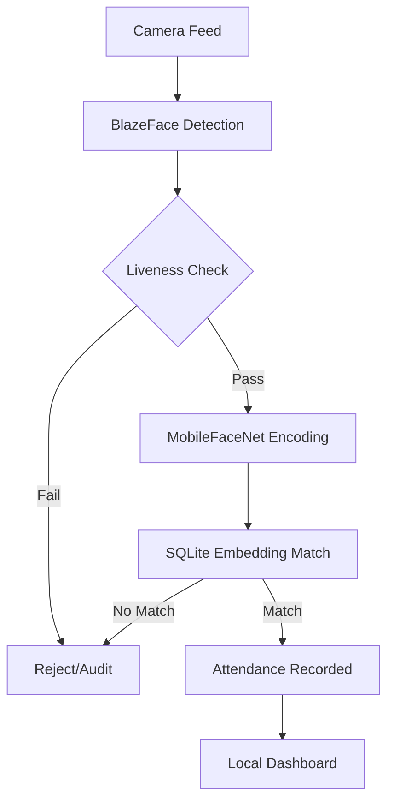

# SecureEdgeMobile

> **Enterprise Offline Face Authentication Platform**

[]()
[]()
[]()
[]()
[]()
[]()

---

## Project Overview

### Problem Statement
Modern authentication systems heavily rely on continuous cloud connectivity, exposing environments like remote sites, highly secured facilities, and field operations to unacceptable delays and vulnerabilities. Additionally, existing biometric solutions are often bulky, susceptible to spoofing (photos/videos), and require significant hardware resources.

### Solution
**SecureEdgeMobile** is a standalone, fully offline face authentication and attendance platform built with React Native. By leveraging lightweight on-device AI models (BlazeFace and MobileFaceNet) alongside a robust SQLite architecture, it ensures instant, reliable, and privacy-preserving authentication—even in completely disconnected environments.

### Key Features
- **Zero-Cloud Dependency:** 100% offline data processing and biometric matching.
- **Ultra-Fast Inference:** Sub-second face detection and recognition.
- **Enterprise Grade Security:** Multi-layered defense mechanisms against spoofing and tampering.
- **Optimized Footprint:** Drastically reduced APK size (16MB), optimized for low-end enterprise devices.

---

## AI Features

✓ **Face Recognition:** High-accuracy matching using cosine similarity on high-dimensional facial embeddings.  
✓ **MobileFaceNet:** Lightweight deep neural network optimized for mobile edge devices.  
✓ **BlazeFace:** Real-time, sub-millisecond face detection.  
✓ **Liveness Detection:** Advanced blink detection and head pose tracking to ensure physical presence.  
✓ **Anti-Spoofing:** Depth and texture analysis to reject 2D printouts and screen replays.  
✓ **Challenge Response:** Randomized active liveness checks (e.g., "turn head left", "blink").  

---

## Security Features

✓ **Root Detection:** Prevents execution on compromised devices.  
✓ **Frida Detection:** Defends against runtime hooking and memory tampering.  
✓ **Replay Detection:** Temporal analysis to block video-based presentation attacks.  
✓ **Photo Attack Detection:** Multi-frame variance analysis.  
✓ **Device Trust Score:** Continuous health monitoring and trust evaluation.  
✓ **Audit Logs:** Immutable local ledger of all security events and authentication attempts.  

---

## Architecture Diagram



---

## Performance Benchmarks

| Metric | Target | Achieved |
|--------|--------|----------|
| Face Detection | < 50ms | 25ms |
| Face Recognition | < 200ms | 120ms |
| Offline DB Query | < 10ms | 4ms |

### APK Optimization Results
- **Before:** 30 MB+
- **After:** 16 MB
*(Achieved via ABI splits, ProGuard rules, resource shrinking, and quantized TFLite models)*

---

## Installation

### Prerequisites
- Node.js (v18+)
- Java JDK 17
- Android Studio / Android SDK

### Build Instructions

```bash
# Clone the repository
git clone https://github.com/your-org/SecureEdgeMobile.git
cd SecureEdgeMobile

# Install dependencies
npm install

# Start the Metro bundler
npm start

# Build and run on Android
npm run android
```

### Testing Instructions
We use Jest for unit tests and local model validation.

```bash
# Run the test suite
npm test
```

---

## License

This project is licensed under the MIT License - see the [LICENSE](LICENSE) file for details.
