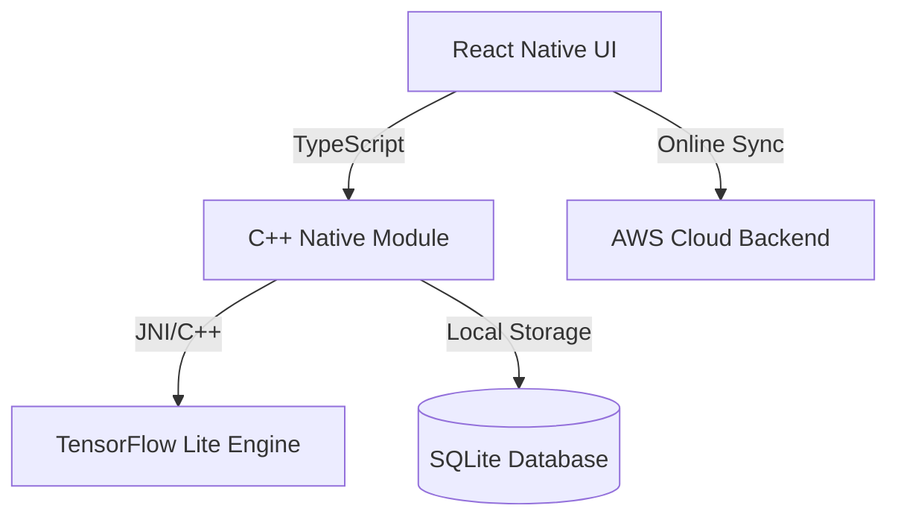

# SecureEdgeAI System Architecture

Offline-first AI-powered face authentication system.

## 1. Components

### Mobile Application (React Native)
- **UI & Presentation**: React Native UI with `react-native-vision-camera` for live camera previews.
- **Native Bridges**: C++ custom bindings (using Nitro Modules) for low-latency communication between the JS engine and native ML processes.

### Edge ML Engine (TensorFlow Lite)
- **Face Detection**: BlazeFace / FaceMesh model running locally.
- **Feature Extraction**: MobileFaceNet model converting detected face boxes into `192-dimensional` embedding vectors.
- **Liveness Detection**: Lightweight classification model.

### Data Storage & Sync
- **Local DB**: SQLite storing user profiles and facial templates offline.
- **Sync service**: Background worker to upload access logs and download database updates from AWS when online.
