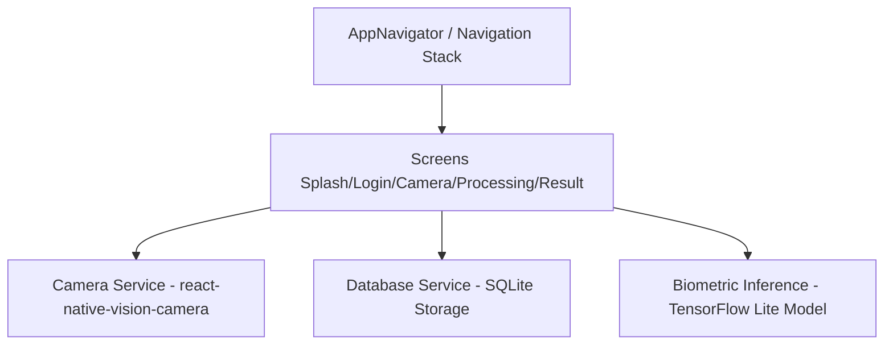

# SecureEdgeAI System Architecture

Offline facial biometric authentication platform for remote environment access.

## 1. Modular System Design

- **Presentation Layer (React Native)**: Built with `@react-navigation/native` to orchestrate navigation transitions. Renders responsive screens utilizing HSL styled CSS sheets.
- **Local Biometric Storage Layer (SQLite)**: SQLite local database holding user identity profiles and their corresponding feature descriptors offline.
- **Biometric Inference Engine (TensorFlow Lite)**: MobileFaceNet (embedding generator) running locally using the native thread JSI execution.
- **Hardware Integration Layer (Vision Camera)**: Custom view managers displaying the camera stream with frame capture capability.
