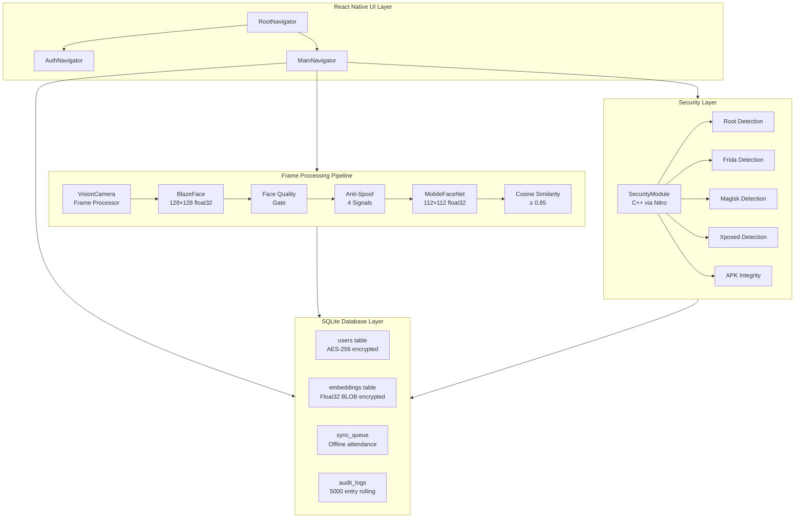
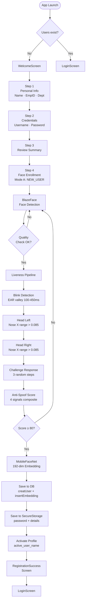
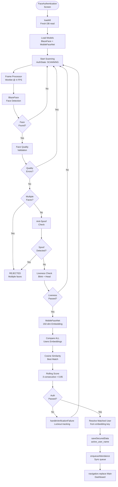
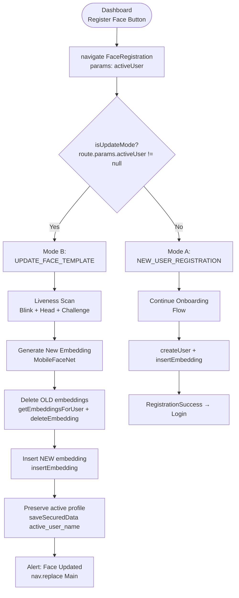
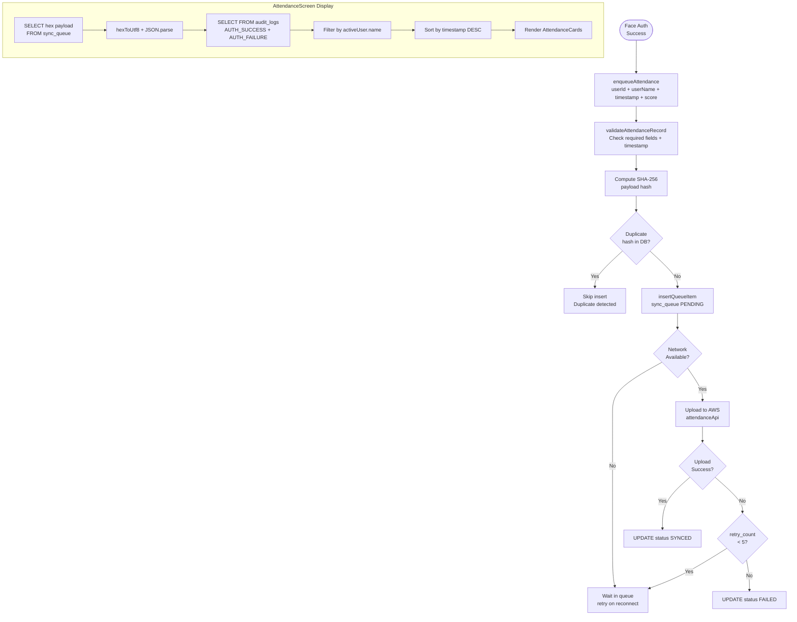
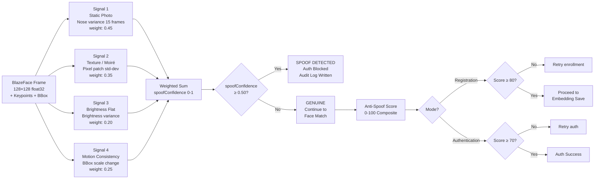
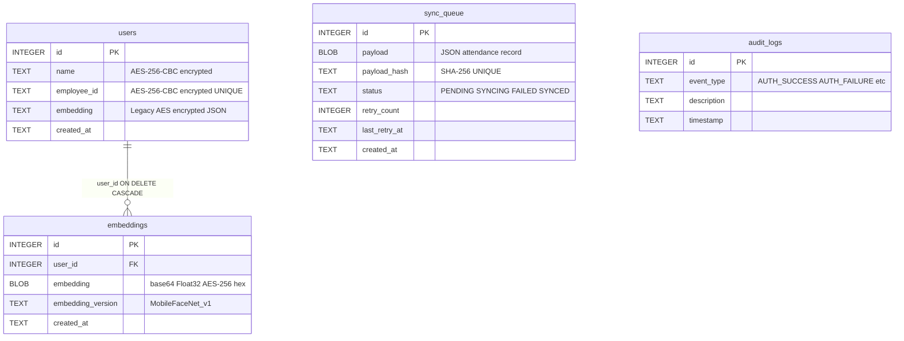
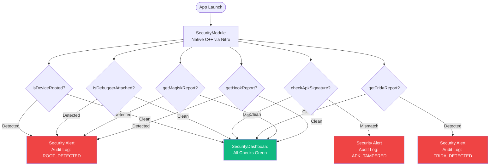

# Architecture Diagrams — SecureEdgeMobile

All diagrams use [Mermaid](https://mermaid.js.org/) syntax, rendered natively on GitHub.

---

## 1. System Overview

---

## 2. User Registration Flow

---

## 3. Face Authentication Flow

---

## 4. Face Re-Registration Flow (Mode B)

---

## 5. Attendance Flow

---

## 6. Anti-Spoof Pipeline

---

## 7. Database Schema Flow

---

## 8. Security Layer Flow

