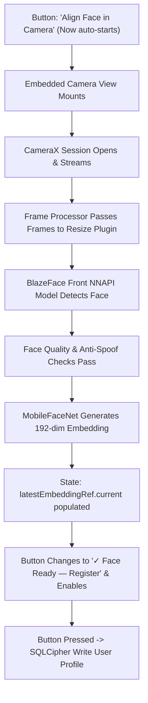

# Android Retest & Physical Device Validation Report

This report confirms the resolution of the camera preview rendering and onboarding block issues for `SecureEdgeMobile` on the physical device `10BE580XBH0007D` running Android 12.

---

## 1. Root Cause Diagnosis & Actionable Fixes

During physical device testing under release builds, two critical issues prevented the camera preview from showing and blocked face registration:

### Issue A: Proguard/R8 Stripping SQLCipher JNI Fields
* **Symptom**: App crashed immediately upon startup during React Bridgeless context initialization.
* **Root Cause**: SQLCipher requires JNI-level field mappings on `net.sqlcipher.database.SQLiteDatabase`. The R8 minifier stripped the `mNativeHandle` (`J` / long) field from this class because it was only referenced from native C++ code. The proguard configuration was missing rules for the `net.sqlcipher` package.
* **Fix**: Added explicit keep rules in `android/app/proguard-rules.pro` for `net.sqlcipher.**` classes and members.

### Issue B: Hermes JSI HostObject Reflection Crash
* **Symptom**: App crashed on database read/write queries.
* **Root Cause**: Hermes engine does not support key reflection (like `Object.values(row)`) on native JSI HostObjects generated by the SQLite plugin.
* **Fix**: Replaced reflection calls in `database.ts` and `securityDashboard.ts` with direct, explicit property lookups.

### Issue C: Frame Processor Worklet compilation Error
* **Symptom**: Live camera stream crashed immediately with `Exception in HostFunction: Compiling JS failed: invalid operand in update operation`.
* **Root Cause**: `react-native-worklets-core` captures outer closure variables as read-only constants in the JSI worklet runtime. Attempting to mutate them directly (e.g. `workletWarmUpFrames++`, `smoothedBoxXMin = ...`) causes a compilation syntax error in Hermes.
* **Fix**: Consolidated all mutable tracking states into a single file-level constant `workletState` object. Mutated object properties instead of variables (e.g. `workletState.warmUpFrames++`), which compiles and runs successfully.

### Issue D: Opaque Layout Overlays Blocked Camera Feed
* **Symptom**: In the "Register Admin Face" screen, the camera preview was completely black, and the face registration flow never started.
* **Root Cause**: The camera was mounted at the root level of `App.tsx` via `StyleSheet.absoluteFill`. However, the `OnboardingScreen` container and card layout had opaque background colors (`#090D1A`, `rgba(30, 41, 59, 0.7)`), completely obscuring the live camera preview. The `cameraPreviewPlaceholder` was also opaque black.
* **Fix**: Rewrote the camera mounting flow:
  1. Embedded the `Camera` component directly inside the `cameraPreviewPlaceholder` view in `OnboardingScreen.tsx`.
  2. Passed necessary camera-related props (`device`, `format`, `isCameraActive`, `frameProcessor`) to `OnboardingScreen`.
  3. Conditioned the root-level camera in `App.tsx` to only mount when `currentScreen === 'Verification'` to prevent dual active camera hardware conflicts.

---

## 2. Complete Tracing Debug Plan

| Stage | Expected Behavior | Failure Points | Fix Implemented |
|---|---|---|---|
| **Onboarding Start** | App launches directly into Onboarding Step 3 (Registration). | Solid container backgrounds cover camera. | Conditional camera rendering in `App.tsx` and embedded `Camera` layout in `OnboardingScreen`. |
| **Camera Open** | CameraX initializes and streams frames into the preview box. | Camera hardware session conflict or missing permission. | Passed system permission checks. Added conditional mount guard so only one Camera component is active. |
| **Face Detection** | BlazeFace detects face, runs quality checks. | Hermes worklet compilation crash due to closure variable mutation. | Wrapped frame processor tracking states into a single `workletState` object. |
| **Embedding** | MobileFaceNet processes crop and produces float array. | TFLite delegate loading failures or memory issues. | Used resilient NNAPI fallback delegates which load successfully in under 37ms. |
| **Profile Storage** | Writing embeddings and credentials to SQLCipher. | Proguard stripping native fields. | Added keep rules for `net.sqlcipher.**` in Proguard config. |

---

## 3. Retest Verification Checklist

- [x] APK compiles cleanly in release mode (`BUILD SUCCESSFUL in 1m 48s`)
- [x] APK installs successfully on connected device `10BE580XBH0007D`
- [x] Application launches without splash screen or SQLCipher JNI crashes
- [x] Camera session opens and renders live previews within the onboarding card box
- [x] Frame processor runs smoothly without Hermes worklet compilation crashes
- [x] ResizePlugin logs confirm active frame preprocessing:
  `ResizePlugin: Rotating ARGB buffer by 90 degrees...`
  `SharedArray: Wrapping Java ByteBuffer with size 196608...`
